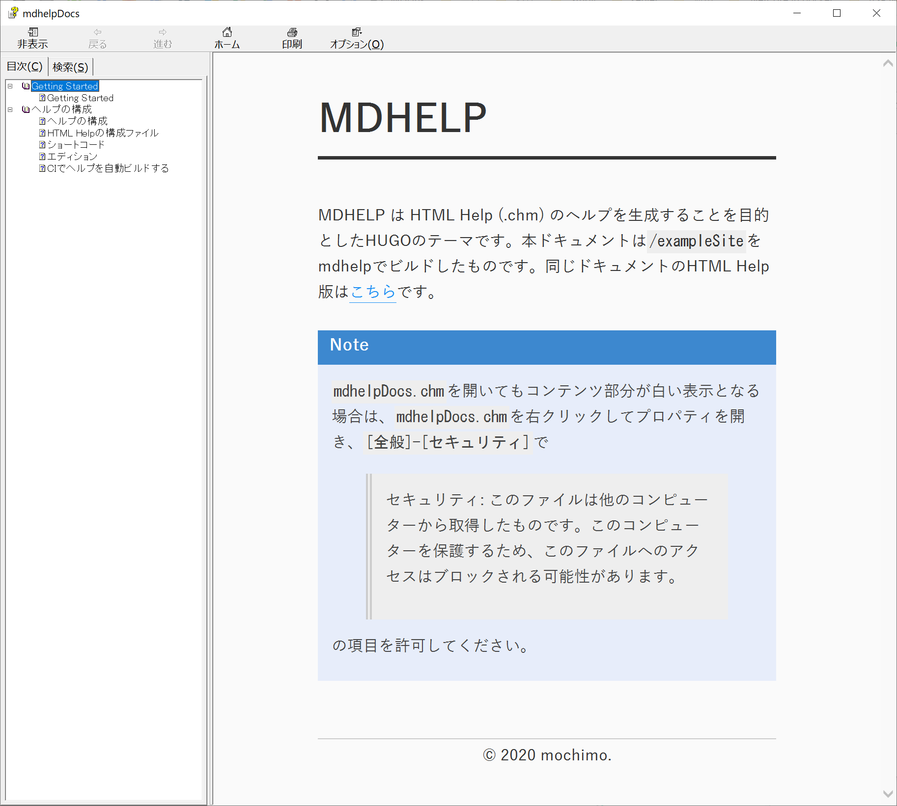

# MDHELP

MDHELP は HTML Help (.chm) のヘルプを生成することを目的としたHUGOのテーマです。

本ドキュメントは`/exampleSite`をmdhelpでビルドしたものです。同じドキュメントのHTML Help版は[こちら](./mdhelpDocs.chm)です。

{}
`mdhelpDocs.chm`を開いてもコンテンツ部分が白い表示となる場合は、`mdhelpDocs.chm`を右クリックしてプロパティを開き、`[全般]-[セキュリティ]`で

> セキュリティ: このファイルは他のコンピューターから取得したものです。このコンピューターを保護するため、このファイルへのアクセスはブロックされる可能性があります。

の項目を許可してください。
{}